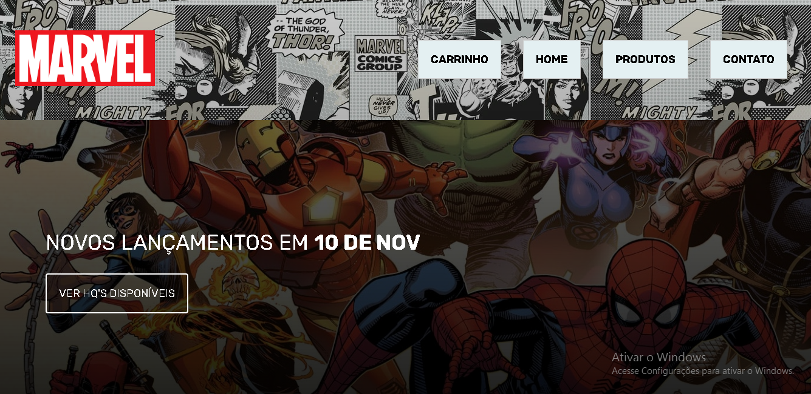
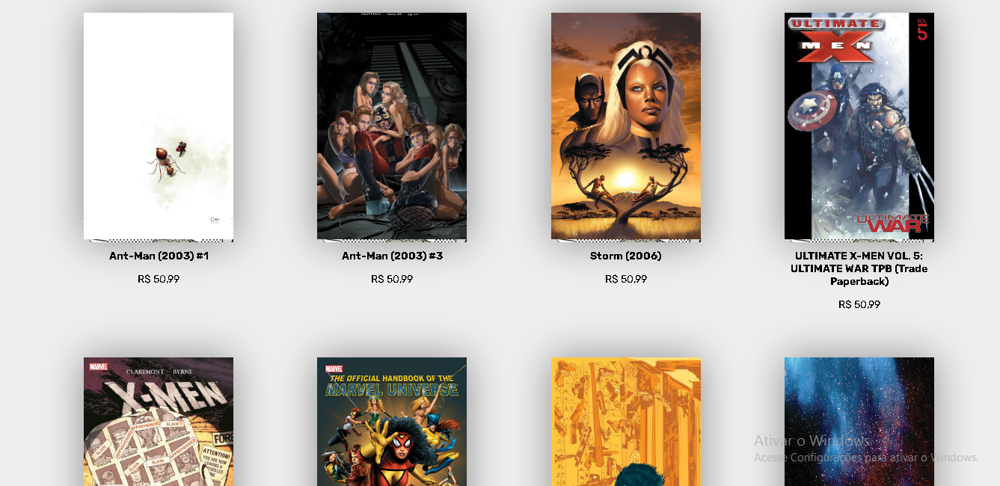
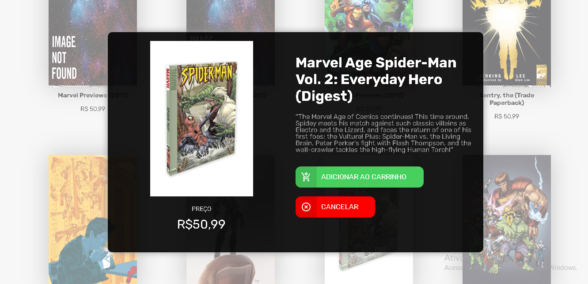
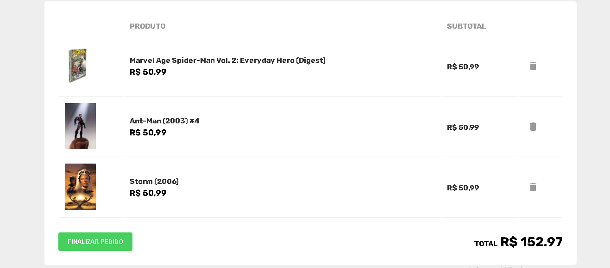

# NEOAPP SELEÇÃO

Projeto criado como etapa de processo seletivo da empresa NeoApp. Aplicação de listagem e carrinho de produtos simulando ecommerce utilizando Typescript + React + Redux. <br/>
As informações referentes aos produtos foram fornecidas pela API da [Marvel](https://developer.marvel.com).


### Status do Projeto

✔️ Concluído.

### 🛠 Tecnologias utilizadas:

Neste projeto foram utilizadas as seguintes tecnologias e bibliotecas:

- [React](https://pt-br.reactjs.org/)
- [Styled-Components](https://styled-components.com/docs/basics#installation)
- [TypeScript](https://www.typescriptlang.org/)
- [React Hooks](https://pt-br.reactjs.org/)
- [Redux Toolkit](https://redux-toolkit.js.org/)
- [React Router](https://reactrouter.com/en/main)
- [Material-UI](https://mui.com/pt/)
- [Axios](https://axios-http.com/ptbr/docs/intro)


### ⚙ Pré-requisitos

Antes de iniciar o projeto, você vai precisar das seguintes ferramentas:

- [VsCode](https://code.visualstudio.com/download)
- [Git](https://git-scm.com/)
- [NodeJs](https://nodejs.org/en/download/)

### 🛠 Desenvolvimento:

- Inicialmente, para pegar as informações dos produtos que iriam aparecer no ecommerce, foi feita uma requisição fetch à API externa. Para isso, foi utilizada a biblioteca axios;
- A aplicação foi dividida em duas páginas, através do React Router --> ficando a divisão da seguinte forma: página home onde foi colcoada a listagem dos produtos e a página do carrinho onde se encontra os produtos selecionados, o cálculo do valor total a ser pago e a função de finalizar a compra;
- Todo o projeto foi dividido em components, como por exemplo, o Footer e o Header;
- Pelo fato de as duas páginas (Home e Cart) possuírem o Footer e o Header, optou-se por criar o componente Theme, no qual incluiu-se esses dois componentes. O restante das páginas que estiverem sendo mostradas ficaria dentro do componente Page --> sendo passados através de uma children;
- Os itens fornecidos pela API (que são mostrados na página Home) foram colocados no component ListItem --> para isso, fez-se a requisição à API, pegou-se o array que retornou e deu-se um map neles, colocando cada um dos itens no component ListItem através da função em questão;
- Optou-se por criar um component Modal onde seriam mostradas as infos de cada HQ. Para isso, passou-se os dados de cada item através de uma Props e, usou-se uma função que exibia o Modal sempre que clicava em algum ListItem --> após clicar no button "adicionar ao carrinho" esse item é colocado no Cart através do gerenciamento de estado global do Redux;
- No carrinho, criou-se uma tabela com os produtos que tiverem sido adicionados. Para isso, deu-se um map nos produtos que haviam sido adicionados no carrinho (foi usado o hook do Redux UseAppSelector);
- Para excluir um produto do carrinho, importou-se a action removeItem criada no reducer que usa o filter para remover o produto que tiver o id selecionado;
- Toda a estilização do projeto foi feita com o styled components --> Usou-se a bibliteca Material-UI para adicionar alguns icons na página apenas para fins de estilização.

### Demonstração:

- Home:


<br/>



- Modal:


- Carrinho:


<br/>

Aplicação rodando no [Vercel](https://selecaoneoapplucas.vercel.app/).

### Clonar o repositório

```bash
$ git clone <https://github.com/lucascavalcan/selecao_neoapp>
```

### Instalar dependências

```bash
npm install
```

### Rodar o projeto

```bash
npm start
```

### Autor

Projeto criado por [Lucas Cavalcanti de Araujo](https://lucascavalcan.github.io/) </br>
Feito com ❤️
